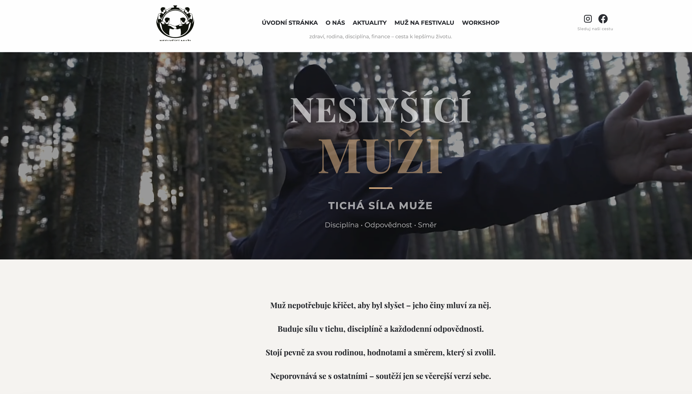

# Neslyšící muži v ČR

Komunitní web pro neslyšící muže v České republice. Představuje komunitu, její aktivity, festivaly a workshopy.

**[Otevřít web](https://jarousek86-ux.github.io/neslysicimuzi/)**



## Obsah a funkce

- Představení komunity a jejího týmu.
- Aktuality, informace o mužském festivalu a workshopech.
- Fotografie a videa z komunitních akcí.
- Kontaktní stránka a odkazy na sociální sítě.
- Mobilní navigace a ovládání přehrávání úvodního videa.
- České titulkové soubory ve formátu WebVTT.

## Technologie

HTML, CSS a JavaScript bez sestavovacího nástroje. Web je publikovaný přes GitHub Pages. Písma se načítají ze služby Google Fonts.

## Spuštění na počítači

Potřebuješ Git a Python 3, případně jiný místní HTTP server.

```bash
git clone https://github.com/jarousek86-ux/neslysicimuzi.git
cd neslysicimuzi
python3 -m http.server 8000 --bind 127.0.0.1
```

V prohlížeči otevři [http://localhost:8000](http://localhost:8000). Server ukončíš klávesami Ctrl+C. Instalace npm balíčků není potřeba.

## Struktura projektu

| Soubor | Účel |
| --- | --- |
| `index.html` | Úvodní stránka |
| `o-nas.html` | Představení komunity |
| `aktuality.html` | Aktuality |
| `muz-na-festivalu.html` | Mužský festival |
| `workshop.html` | Workshopy |
| `kontakt.html` | Kontakty |
| `style.css` | Vzhled a responzivní rozložení |
| `script.js` | Sdílené chování navigace, videa a animací |
| `assets/images/` | Obrázky a náhled webu |
| `assets/videos/` | Videa |
| `assets/captions/` | České titulky WebVTT |

## Před zveřejněním změn

1. Připrav změnu v samostatné větvi a otevři pull request.
2. Ověř navigaci a odkazy na počítači i mobilu.
3. Zkontroluj načtení obrázků, přehrávání videí a titulky.
4. Vyzkoušej ovládání klávesnicí a viditelnost zaměření.
5. Po sloučení zkontroluj nasazení v GitHub Actions a výsledný web.

## Další rozvoj

- Doplnit automatické kontroly odkazů a HTML.
- Dále ověřovat přístupnost a rychlost načítání na mobilních zařízeních.

## Licence

Zdrojový kód je dostupný pod licencí MIT, viz [LICENSE](LICENSE). Fotografie, videa a logo nejsou součástí licence – všechna práva vyhrazena.

## Autor

[Jaroslav Klein](https://github.com/jarousek86-ux) – komunitní web a rozvoj front-endových dovedností.
